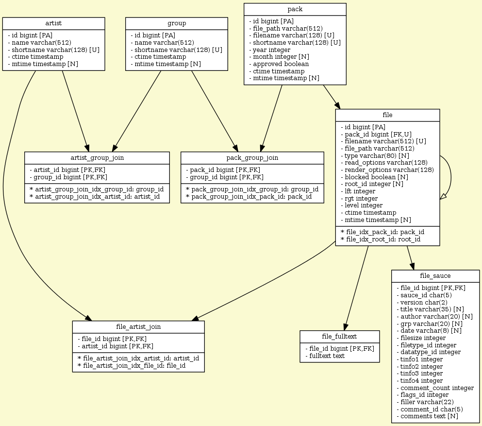

# Sixteen Colors

A perl-based application to run the Sixteen Colors Art Pack Archive.

## Database Schema



## [*In Progress*] Installation (Ubuntu)

### Notes

* These steps assume a fresh, bare-bones install of Ubuntu 14.04.
* Everything will be deployed to `/var/www/sixteencolors.net/`.
* The site will be served via nginx to a reverse proxied plack-based listener.

### Steps

1. Install required packages.

    ```
    sudo apt-get install build-essential libarchive-dev libgd-dev nginx git vlc-nox
    ```

2. Create deployment directory.

    ```
    sudo mkdir -p /var/www/sixteencolors.net/
    sudo chown $USER /var/www/sixteencolors.net/
    ```

3. Install perlbrew.

    ```
    wget -O - http://install.perlbrew.pl | sudo PERLBREW_ROOT=/var/www/sixteencolors.net/perl5 bash
    echo 'source /var/www/sixteencolors.net/perl5/etc/bashrc' >> ~/.bash_profile
    source ~/.bash_profile
    ```

4. Install perl.

    ```
    perlbrew install --notest --switch stable
    ```

5. Install cpanm.

    ```
    perlbrew install-cpanm
    ```

6. Clone the application repository. *NB:* Using `code-refresh` branch.

    ```
    cd /var/www/sixteencolors.net/ && git clone -b code-refresh https://github.com/sixteencolors/sixteencolors.git app
    ```

7. Download the archive. *WARNING:* Very large.

    ```
    git clone https://github.com/sixteencolors/sixteencolors-archive.git archive
    ln -s /var/www/sixteencolors.net/archive app/root/static/packs
    ```

8. Install perl dependencies. *WARNING:* This will take a long time.

    ```
    cd /var/www/sixteencolors.net/app/ && cpanm --notest --installdeps .
    ```

    Note: Due to a bug in the [GD perl module](https://metacpan.org/release/GD) which affects 
    its capability to generate animated GIFs, you'll need to download it, 
    [apply a patch](https://rt.cpan.org/Ticket/Attachment/1409528/748127/animgif-2-1-x.patch) 
    and install it manually.

9. (Optional) Install and add credentials for your database backend. Example: MySQL

    Install the DB server application and client library dev package:

    ```
    sudo apt-get install mysql-server libmysqlclient-dev
    ```

    Install the perl DBD driver:

    ```
    cpanm --notest DBD::mysql
    ```

    Create the database and add the user:
    ```
    mysql -u root -p
    CREATE DATABASE sixteencolors;
    GRANT ALL ON sixteencolors.* TO 'sixteencolors'@'localhost' IDENTIFIED BY 'sixteencolors';
    FLUSH PRIVILEGES;
    quit;
    ```

    Add connection details to sixteencolors_local.conf

    ```
    <Model::DB>
        <connect_info>
            dsn          dbi:mysql:dbname=sixteencolors
            user         sixteencolors
            password     sixteencolors
        </connect_info>
    </Model::DB>
    ```

10. Deploy the database schema.

    *NB:* For MySQL, due to [an issue in DBIx::Class::Tree::NestedSet](https://rt.cpan.org/Ticket/Display.html?id=98147) you must
    deploy the schema using a pre-generated sql file:

    ```
    mysql -u sixteencolors -p sixteencolors < etc/deploy-mysql.sql
    ```

    Otherwise:

    ```
    ./bin/deploy_schema.pl
    ```

11. Index the archive.

    ```
    ./bin/indexer.pl ../archive/
    ```

### Sample CLI using vlc to convert tracker files

```
vlc -Idummy -vvv input.s3m --sout "#transcode{vcodec=none,acodec=mp3,ab=128,channels=2,samplerate=44100}:file{dst=output.mp3}"
```
